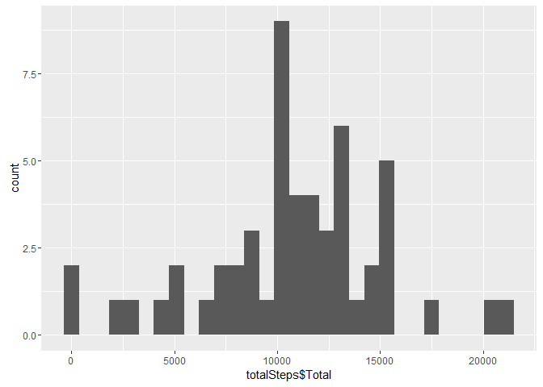
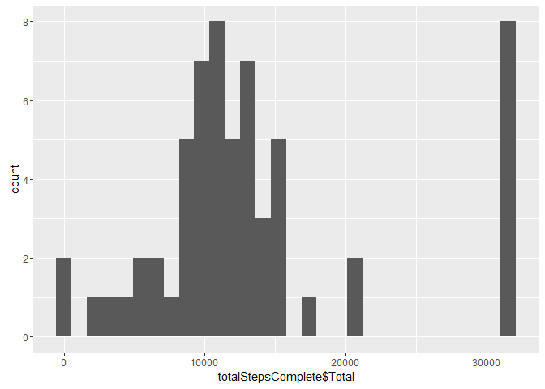
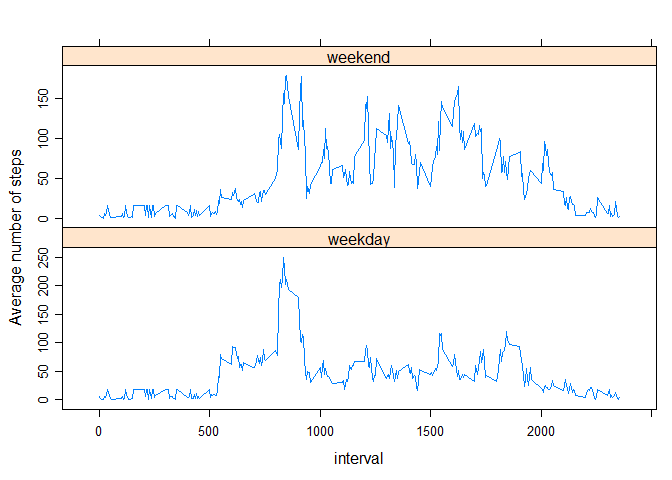

# Reproducible Research: Peer Assessment 1

### Loading and preprocessing the data

```r
library(ggplot2)
library(lattice)
rm(list=ls())
setwd("~/R/Coursera/5-Reproducible Research/Week2-CourseProject/RepData_PeerAssessment1-master")
unzip("activity.zip")
activity<-read.csv("activity.csv", header=TRUE, sep=",")
```
### What is mean total number of steps taken per day?
#### Make a histogram of the total number of steps taken each day

```r
activitySubset<-subset(activity, subset=(steps>0))  
totalSteps<-aggregate(activitySubset$steps, by=list(Category=activitySubset$date), FUN=sum)
colnames(totalSteps)<-c("Date", "Total")
qplot(totalSteps$Total)
```

```
## `stat_bin()` using `bins = 30`. Pick better value with `binwidth`.
```

<!-- -->

#### Calculate and report the mean and median total number of steps taken per day

```r
options(scipen=999)
meanSteps<-mean(totalSteps$Total)
medianSteps<-median(totalSteps$Total)
```
The mean number of steps is 10766.1886792.  The median number is 10765.

### What is the average daily activity pattern?

#### Make a time series plot (i.e. type = "l") of the 5-minute interval (x-axis) and the average number of steps taken, averaged across all days (y-axis)

```r
averageSteps<-aggregate(activitySubset$steps, by=list(activitySubset$interval), FUN=mean)
colnames(averageSteps)<-c("interval","average")
plot(averageSteps, type="l", main="Average Steps per Interval", xlab="Interval", ylab="Number of Steps")
```

<!-- -->

#### Which 5-minute interval, on average across all the days in the dataset, contains the maximum number of steps?

```r
averageSteps<-averageSteps[order(-averageSteps$average),]
maxAverageSteps<-averageSteps[1,1]
```
The maximum number of steps occurs, on average, at the 835 interval.

### Imputing missing values

#### Calculate and report the total number of missing values in the dataset (i.e. the total number of rows with NAs)

```r
activityNA<-subset(activity, is.na(activity$steps)==TRUE)
colSums(is.na(activity))
```

```
##    steps     date interval 
##     2304        0        0
```
There are 2304 missing values in the dataset.

### Devise a strategy for filling in all of the missing values in the dataset. The strategy does not need to be sophisticated. For example, you could use the mean/median for that day, or the mean for that 5-minute interval, etc.
#### Create a new dataset that is equal to the original dataset but with the missing data filled in.

```r
averageSteps<-averageSteps[order(averageSteps$interval),]
activity$complete<-ifelse(is.na(activity$steps), averageSteps[match(activity$interval, averageSteps$interval),2] ,activity$steps)
activity$complete<-ifelse(is.na(activity$complete), mean(activitySubset$steps) ,activity$complete)
```

#### Make a histogram of the total number of steps taken each day and Calculate and report the mean and median total number of steps taken per day. Do these values differ from the estimates from the first part of the assignment? What is the impact of imputing missing data on the estimates of the total daily number of steps?

```r
totalStepsComplete<-aggregate(activity$complete, by=list(Category=activity$date), FUN=sum)
colnames(totalStepsComplete)<-c("Date", "Total")
qplot(totalStepsComplete$Total)
```

```
## `stat_bin()` using `bins = 30`. Pick better value with `binwidth`.
```

<!-- -->

```r
meanStepsComplete<-mean(totalStepsComplete$Total)
medianStepsComplete<-median(totalStepsComplete$Total)
```
### Are there differences in activity patterns between weekdays and weekends?

#### Create a new factor variable in the dataset with two levels - "weekday" and "weekend" indicating whether a given date is a weekday or weekend day.

```r
activity$day<-weekdays(as.Date(activity$date))
weekend<-c("Sunday", "Saturday")
activity$WEWD<-c("weekday", "weekend")[(activity$day %in% weekend)+1L]
```
#### Make a panel plot containing a time series plot (i.e. type = "l") of the 5-minute interval (x-axis) and the average number of steps taken, averaged across all weekday days or weekend days (y-axis). The plot should look something like the following, which was creating using simulated data.

```r
averageStepsComplete<-aggregate(activity$complete, by=list(activity$interval, activity$WEWD), FUN=mean)
colnames(averageStepsComplete)<-c("interval","WEWD", "steps")
xyplot(steps~interval|WEWD, data=averageStepsComplete, type="l", scales=list(y=list(relation="free")),layout=c(1,2), ylab="Average number of steps")
```

<!-- -->

Yes, although periods of activity tend to be greater during the day, there are two major differences in the activity patterns between weekdays and weekends.

1. Weekends tend to have a greater number of steps over a longer period of time.

2. Weekdays have a spike in the morning that is greater than any of the weekend values.  Maybe that's when people are out for a morning run?

3. Weekend activity tapers off later than weekday activity.
